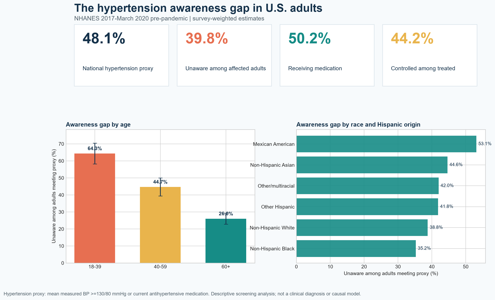

# Hidden Hypertension: A Survey-Weighted NHANES Awareness-Gap Analysis



## Executive summary

How many U.S. adults meet a measured-blood-pressure or medication-based
hypertension proxy without reporting that a health professional has ever told
them they have hypertension?

I analyzed public-use CDC/NCHS NHANES 2017-March 2020 pre-pandemic data with
the special examination weight, masked variance strata, and primary sampling
units. The analytic sample included **7,938 nonpregnant adults aged 18 years or
older with at least two valid oscillometric blood-pressure readings**.

Under a `>=130/80 mmHg or current antihypertensive medication` definition:

- **48.1%** of U.S. adults met the analytic hypertension proxy (95% CI: 45.4%-50.8%).
- Among adults meeting the proxy, **39.8%** reported no prior hypertension diagnosis (95% CI: 37.0%-42.6%).
- The awareness gap was **64.3%** among adults aged 18-39, compared with 44.7% at ages 40-59 and 26.0% at age 60 or older.
- **50.2%** of adults meeting the proxy reported current medication use (95% CI: 47.4%-53.0%).
- Among treated adults, **44.2%** had mean measured BP below 130/80 (95% CI: 42.0%-46.5%).

These are descriptive screening estimates from a pre-pandemic cross-section.
They are not current surveillance estimates, causal effects, or individual
clinical diagnoses.

## Why this project matters

Hypertension programs need to distinguish three related problems: elevated
measured blood pressure, lack of awareness, and lack of control after treatment.
A single prevalence estimate hides those different intervention points. This
analysis makes the care cascade visible and demonstrates how estimates change
under two commonly used thresholds.

## Technical skills demonstrated

- **SAS:** XPORT ingestion, reproducible derivation, `PROC SURVEYMEANS`,
  `PROC SURVEYLOGISTIC`, domain estimation, QA tables, and ODS exports
- **Python:** SAS transport ingestion, validated merges, Taylor-linearized
  weighted proportions and confidence intervals, sensitivity analysis, and
  publication-quality visualization
- **Biostatistics:** complex survey design, domain estimation, weighted
  prevalence, confidence intervals, sensitivity analysis, and transparent
  denominator definitions
- **Epidemiology:** operational case definitions, awareness/treatment/control
  cascade, subgroup comparisons, bias assessment, and noncausal interpretation

## Study design

### Data

Public-use [NHANES 2017-March 2020 pre-pandemic files](https://wwwn.cdc.gov/nchs/nhanes/Default.aspx):

- [P_DEMO](https://wwwn.cdc.gov/Nchs/Data/Nhanes/Public/2017/DataFiles/P_DEMO.htm): demographics, examination weight, strata, and PSU
- [P_BPQ](https://wwwn.cdc.gov/Nchs/Data/Nhanes/Public/2017/DataFiles/P_BPQ.htm): hypertension awareness and treatment
- [P_BPXO](https://wwwn.cdc.gov/Nchs/Data/Nhanes/Public/2017/DataFiles/P_BPXO.htm): three standardized oscillometric readings

CDC combined the incomplete 2019-March 2020 sample with the complete 2017-2018
cycle and produced special weights so the combined file can support national
estimation. This project follows the [NCHS sample-design and analytic guidance](https://stacks.cdc.gov/view/cdc/115434).

### Population

Included adults were age 18 or older, not recorded as pregnant, had a positive
MEC examination weight, and had at least two valid systolic and diastolic
readings. Of 9,445 participants present in all three source components, 7,938
met these criteria.

### Measures

The primary proxy classified a participant as meeting the hypertension
definition when mean measured systolic BP was at least 130 mmHg, mean diastolic
BP was at least 80 mmHg, or the participant reported current prescribed
antihypertensive medication. The threshold follows the
[2017 ACC/AHA guideline](https://www.ahajournals.org/doi/full/10.1161/CIR.0000000000000596).

Awareness was based on reporting that a doctor or other health professional had
ever said the participant had hypertension. A sensitivity analysis repeated the
analysis with the older `>=140/90 mmHg or medication` definition.

### Survey estimation

National estimates use `WTMECPRP`, `SDMVSTRA`, and `SDMVPSU`. The Python
workflow calculates ratio estimates and Taylor-series standard errors from
weighted PSU totals. The SAS workflow uses survey procedures with the same
weight and design variables. Subgroup estimates are treated as domains so that
PSUs outside a subgroup contribute zero rather than disappearing from the
variance structure.

## Results

| Measure | Weighted estimate | 95% CI | Unweighted denominator |
|---|---:|---:|---:|
| Hypertension proxy, >=130/80 or medication | 48.1% | 45.4%-50.8% | 7,938 |
| Unaware among adults meeting primary proxy | 39.8% | 37.0%-42.6% | 4,289 |
| Treated among adults meeting primary proxy | 50.2% | 47.4%-53.0% | 4,297 |
| Controlled below 130/80 among treated adults | 44.2% | 42.0%-46.5% | 2,307 |

### Threshold sensitivity

Changing the measured-BP threshold from 130/80 to 140/90 reduced the estimated
hypertension-proxy prevalence from **48.1% to 33.5%** and the unawareness share
from **39.8% to 21.0%**. This is a policy-relevant reminder that the operational
definition materially changes both the numerator and the population targeted
for outreach.

Detailed tables are in [`outputs/tables`](outputs/tables), including estimates
by sex, age, race and Hispanic origin, education, and family-income-to-poverty
ratio. Subgroup comparisons are descriptive and should not be read as biological
or causal differences.

## Reproduce the analysis

### Python

```bash
python -m venv .venv
.venv/Scripts/activate       # Windows
pip install -r requirements.txt
python python/analyze.py
python -m unittest discover -s tests -v
```

### SAS OnDemand or SAS 9.4

1. Upload the repository, preserving `data/raw`.
2. Open [`sas/nhanes_hypertension_analysis.sas`](sas/nhanes_hypertension_analysis.sas).
3. Change the `ROOT` macro variable to the uploaded project path.
4. Run the program. It imports all three XPT files, derives the cohort, produces
   national and domain estimates, fits a descriptive survey-weighted logistic
   model, runs threshold sensitivity, and exports QA/results tables.
5. Compare the four headline SAS estimates with
   [`outputs/tables/overall_estimates.csv`](outputs/tables/overall_estimates.csv).

The SAS code is designed against documented SAS 9.4 survey-procedure syntax.
It has not been executed in this environment because no licensed SAS runtime is
available; that limitation is explicit rather than presenting unverified SAS
output as completed validation.

## Quality checks

- One-to-one respondent merges are enforced in Python.
- Duplicate `SEQN` count in the analytic file: **0**.
- Final sample spans **24 masked strata and 49 masked PSU combinations**.
- **7,918 of 7,938** eligible adults had all three BP readings.
- Headline estimates are bounded, denominators are explicit, and the 140/90
  sensitivity direction is tested automatically.
- Raw data links, variable definitions, and analytic limitations are documented.

## Limitations and responsible interpretation

- The data describe the U.S. civilian noninstitutionalized population before
  the COVID-19 pandemic; they should not be labeled as 2026 prevalence.
- A one-visit mean is not equivalent to a clinical diagnosis confirmed across
  separate encounters, and white-coat or masked hypertension cannot be assessed.
- Awareness and medication use are self-reported and may be misclassified.
- The proxy combines measured elevation and medication use; treated adults with
  controlled measurements remain in the hypertension denominator by design.
- Residual nonresponse or measurement bias may remain after survey weighting.
- Subgroup estimates are useful for hypothesis generation and program planning,
  not for causal or biological claims.
- Public-use data are de-identified. This project uses no PHI, confidential data,
  or employer information.

## Repository structure

```text
data/          raw XPT files, processed analytic file, provenance
docs/          data dictionary, portfolio and publishing drafts
outputs/       figures and CSV result/QA tables
python/        independently executable Python workflow
sas/           substantive SAS survey-analysis workflow
tests/         automated output checks
```

## References

1. CDC/NCHS. [NHANES 2017-March 2020 pre-pandemic sample design, estimation, and analytic guidelines](https://stacks.cdc.gov/view/cdc/115434).
2. CDC/NCHS. [Guidelines for High Quality Analyses of NHANES Data](https://wwwn.cdc.gov/nchs/nhanes/QualityAnalysesGuidelines.aspx).
3. CDC/NCHS. [P_BPXO blood-pressure examination documentation](https://wwwn.cdc.gov/Nchs/Data/Nhanes/Public/2017/DataFiles/P_BPXO.htm).
4. Whelton PK, et al. [2017 ACC/AHA guideline for high blood pressure in adults](https://www.ahajournals.org/doi/full/10.1161/CIR.0000000000000596). *Circulation*. 2018.

## Author

**Kira Gor, BDS, MPH**  
Epidemiology and healthcare data analytics  
[LinkedIn](https://www.linkedin.com/in/dr-kira-gor/) · [GitHub](https://github.com/gorkira28)

## License

Code and documentation are released under the [MIT License](LICENSE). The
source data remain governed by CDC/NCHS terms and documentation.
